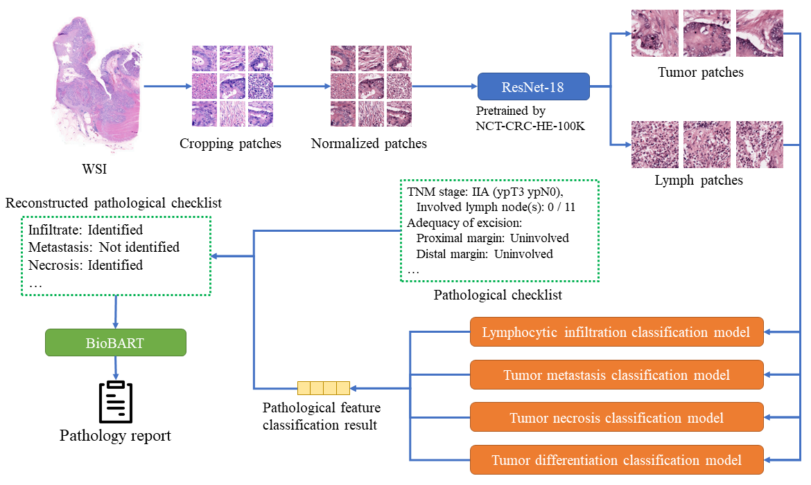
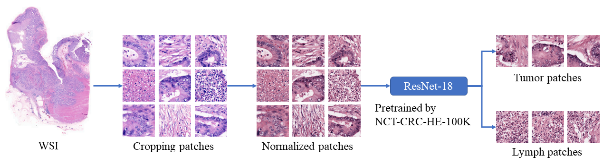
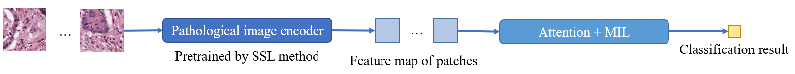
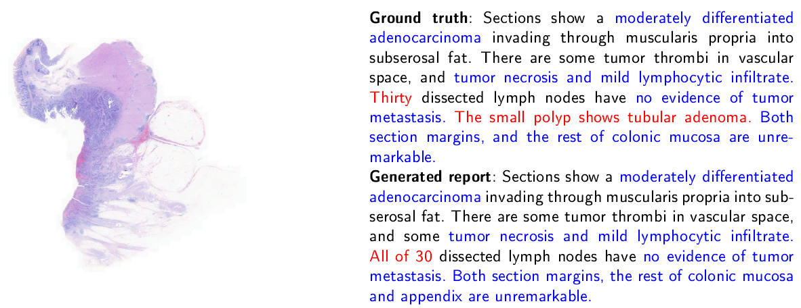
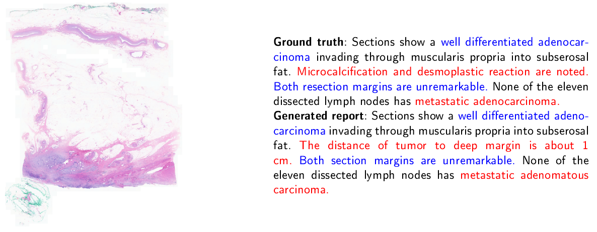
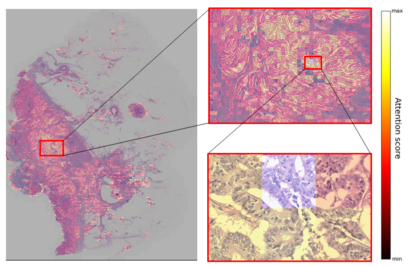

# Research of Automated Pathology Report Generation from Whole-Slide Histopathology Image
Research for my master’s thesis \
Special thanks to 成大醫院林鵬展醫師、暨大資工周信宏老師和成大資工謝孫源老師

# Data usage
Data used in the research are collected from NCKU hospital \
**Due to privacy concerns, the dataset cannot be made publicly available.** \
Please feel free to contact us via email for further discussion if needed.
# Motivation
* Issue of image data: WSI has large size and high resolution large amount of data high computational resource few patch-level label, labeling is labor-intensive and time-consuming
* Issue of texture data: diversity report description It is difficult for the model to learn different doctors may subjectively emphasize distinct features.

>**Objective**: Develop an integrated framework that combines WSI analysis and report generation to enhance diagnostic efficiency and reduce pathologists’ workload.

# Framework Overview

# Data preprocessing

* Because the original pathology whole-slide images are extremely large and our hardware can’t handle feeding the entire image into the model at once, we first split each slide into 224×224 patches. After that, we applied Macenko color normalization to make sure all patches share a consistent color distribution. After that we used a ResNet-18 model which was pretrained on the public NCT-CRC-HE-100K dataset to classify 9 different tissue types. From its results, we only selected patches classified as “lym” and “tum,” since we believe these two categories are most relevant to the pathological features we aim to analyze.

# MIL classification model workflow

# Report generation example

# Attention heatmap

# Codes
* report_parser.py
    * For extract information from original histopathology report
* model.py
    * Model architectures
* pretrain_lm.py
    * Fine-tune language model for report text data
* Image_checklist_BioGPT.py
    * Training procedure with BioBERT+BioGPT architecture
* Image_checklist_BioGPT_inference.py
    * Inference procedure with BioBERT+BioGPT architecture